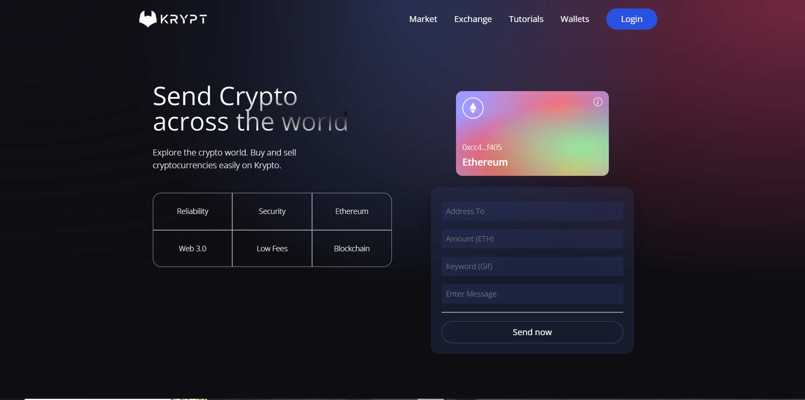
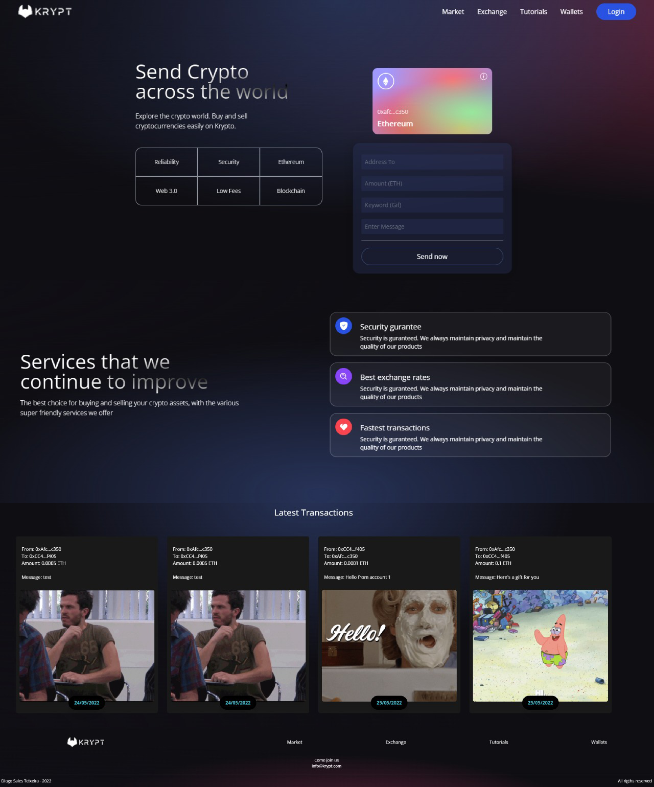
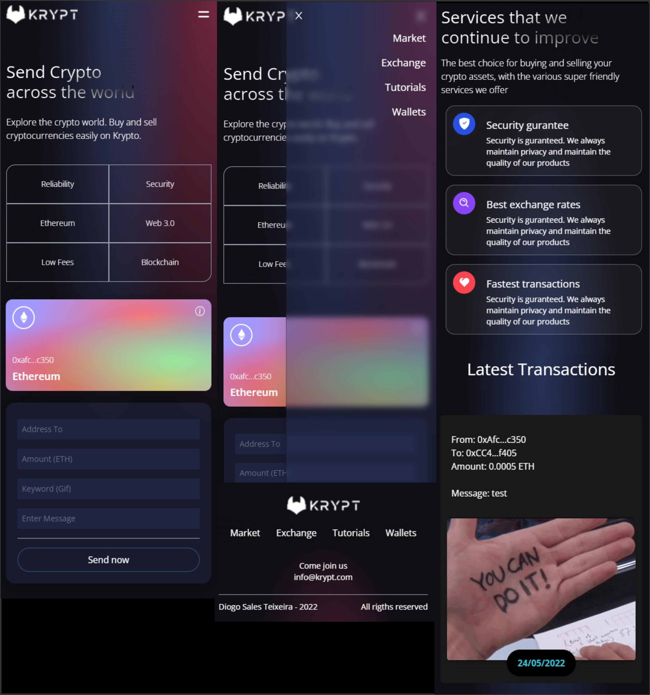

# Krypt - Web 3.0 Blockchain Application

# Project in Vercel for testing

<a href="https://krypt-jade.vercel.app/">Click here to go to the project page</a>

# About the project

Krypt is a Web 3.0 Application that uses Web 3.0 methodologies, React, Blockchain, Solidity and Metamask.

Krypt is a application With a stunning design, connected to the blockchain, metamask pairing, interaction with smart contracts, sending Ethereum through the blockchain network, writing solidity code, and much more.

# Project in web

# Project in mobile

